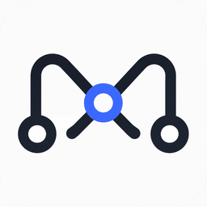

# Mote



Mote 是一套个人远程动作系统：用 iPhone 锁定自己的 Mac。一台 Relay，操作者自己的一台或多台 Mac。

当前 iPhone 侧走 **Apple 快捷指令 + Siri**。快捷指令向你的公网 Relay 发送经过认证的 HTTPS 请求。**Mote Relay** 再通过 Mac 主动连出的 WebSocket 把命令转发给 **Mote Agent**（运行在 **Mote for Mac** 中）。Dashboard 由同一个 Worker 的静态资源提供。原生 **Mote iOS** 尚未进仓库；后端已预留活动来源 `ios`，见 [docs/ios.md](docs/ios.md)。

```text
当前:
Apple Shortcut / Dashboard → Mote Relay → Mote Agent → Lock
```

本仓库名为 `mote`。**Relay** 只是后端组件，不是产品名。

文档示意图里的 `relay.example.com` 只说明 URL 形状。Mac 的 Bundle ID 是 `com.nardo021.mote`，没有编译进去的默认 Relay 主机名。生产 Relay 用 `MOTE_PUBLIC_URL`；Mac 用设置里的 Relay URL 或 `MOTE_RELAY_URL`，缺了就保持未配置。

## 架构

```text
Internet
    → Cloudflare Worker
    → 一个 MoteRelay Durable Object
    → Mac 出站 WSS

Dashboard：Workers Assets
```

Cloudflare Access 不是 Mote 的认证。Cloudflare Tunnel 不是生产架构的一部分。Node / Docker 自托管不再支持。

```text
relay.example.com
│
├── /                    Dashboard（Workers Assets）
├── /admin/api/*         Admin API
├── /admin/api/events    Dashboard SSE（只推 topic）
├── /v1/*                Machine API
├── /v1/ws/device        Mac WebSocket
├── /v1/ws/pair          Pairing WebSocket
├── /v1/pair/requests    公开配对请求
├── /s/:deviceId         Shortcut 安装页
├── /health
└── /ready
```

细节见 [docs/architecture.md](docs/architecture.md)。

## 部署到 Cloudflare

[](https://deploy.workers.cloudflare.com/?url=https://github.com/Nardo021/Mote)

1. 点上面的按钮，登录自己的 Cloudflare 账号。
2. 填写 `MOTE_ADMIN_PASSWORD`（至少 12 位）。用户名是 `admin`。Workers Builds 的构建命令用 `npm run ci`，部署命令用 `npx wrangler deploy`。`npm run ci` 失败时不会部署。
3. 打开 `https://mote.<你的子域>.workers.dev`，用这个账号登录 Dashboard。
4. 在自己的 Mac 上用 Xcode 打开 `macos/Mote.xcodeproj`。Bundle ID 保持 `com.nardo021.mote`。在本机选择 Development Team 后 Run 或 Archive。不要把 Team ID 或证书提交进仓库。仓库不提供现成签名包。
5. 打开 Mote，把 Relay URL 填成这个 `https://mote.<子域>.workers.dev`，点 **Pair**。
6. 浏览器打开同一地址，Dashboard **Allow**。iPhone 快捷指令也指向该 HTTPS 基址。见 [docs/shortcuts.md](docs/shortcuts.md)。

维护本仓库、希望 `git push` 到 `main` 就更新这一份线上 Relay 时，在 GitHub 仓库 Secrets 里设置 `CLOUDFLARE_API_TOKEN` 和 `CLOUDFLARE_ACCOUNT_ID`。CI 先跑测试和干跑；只有推送到 `main` 且 CI 成功，`.github/workflows/deploy-cloudflare.yml` 才会执行 `wrangler deploy`。密钥不会写进日志。

自定义域名仍然可以绑到这个 Worker。客户端只使用该 HTTPS 主机名。

## 配置 Mac

1. 用 Xcode 打开 `macos/Mote.xcodeproj`。Bundle ID 保持 `com.nardo021.mote`，只在本机选择 Development Team。
2. Relay URL 填 Worker 的 HTTPS 基址，例如 `https://mote.<子域>.workers.dev`。
3. 本地开发则填 `http://127.0.0.1:8787`。

见 [macos/README.md](macos/README.md)。

## 配对

1. Mac 点 **Pair**。
2. Dashboard **Devices** 里 **Allow**。
3. 凭据经已认证的配对 WebSocket 写入钥匙串，Mac 立刻连接。

配对密钥不放在 URL 里。

## 快捷指令 token

1. Dashboard **Tokens** → 选这一台设备 → **Create Token**。
2. 明文只出现一次。复制进快捷指令的 Authorization 头：`Bearer <token>`。
3. 请求 `POST /v1/devices/<DEVICE_ID>/commands`，正文 `{"action":"lock"}`。

Token 只作用于这一台设备。步骤见 [docs/shortcuts.md](docs/shortcuts.md)。

## 安全

- 动作来自预定义允许列表。当前唯一动作是 `lock`。
- 禁止任意 shell 命令、可执行路径，以及远程下发的 AppleScript。
- 快捷指令凭据（`send_command`）与 Mac 设备凭据（`device_connection`）不可互换。管理员是独立的用户名/密码会话。
- 生产流量仅使用 HTTPS/WSS。
- Relay 只保存凭据哈希。明文只在创建或轮换时出现一次。
- 离线命令立即返回，不排队。
- Cloudflare Access 不能挡在快捷指令或 Mac WebSocket 前面。

细节见 [docs/security.md](docs/security.md)。

## 本地开发

```text
cp .dev.vars.example .dev.vars
npm run dev:worker
```

Worker 和已构建的 Dashboard 在 `http://127.0.0.1:8787`。改界面时另开 `npm run dev --prefix dashboard`（`5173`，API 代理到 `8787`）。

```text
npm test
npm run typecheck
npm run worker:dry-run
```

见 [CONTRIBUTING.md](CONTRIBUTING.md)。macOS 安全测试用 scheme `Mote` 的测试计划 `Mote-Safe`。

见 [docs/development.md](docs/development.md)。

## 当前范围

- 一台 Relay，操作者自己的一台或多台 Mac。
- iPhone 用 Apple 快捷指令 + Siri；Dashboard 也可以发 `lock`。
- 快捷指令与之后的 iOS 客户端始终访问公网 HTTPS 基址。
- Mote for Mac 始终连接该基址上的 `wss://…/v1/ws/device`。未配置时走 `wss://…/v1/ws/pair`。
- 在家和外出都走同一条公网主机名。当前不使用 Split DNS。
- 唯一动作为 `lock`。
- 架构中永不包含任意 shell 执行。
- 原生 iOS 应用尚未实现。

## 仓库结构

```text
mote/
├── docs/          架构、协议、安全、部署、开发、快捷指令、iOS
├── design.md      视觉与文案规范
├── macos/         Mote for Mac
├── dashboard/     Mote Relay Dashboard（React + Vite）
├── relay/         Mote Relay（Worker 与共享领域代码）
├── protocol/      Protocol v1 fixtures
├── scripts/       一致性检查与 Worker 类型生成
└── .github/       CI、Cloudflare 部署、macOS 发行工作流
```

仓库里还没有 `ios/` 目录。`deploy/` 只保留一句历史说明：Docker 自托管已经移除。

## 技术栈

| 区域         | 技术                                                                                                         | 状态              |
| ------------ | ------------------------------------------------------------------------------------------------------------ | ----------------- |
| Mote for Mac | Swift 6、SwiftUI、菜单栏、ServiceManagement、URLSession WebSocket、Network.framework、Keychain、CoreGraphics | 已实现（1.5.6）   |
| Mote Relay   | Cloudflare Worker、一个 Durable Object、Durable Object SQLite、Workers Assets                               | 已实现            |
| Dashboard    | React、TypeScript、Vite、shadcn/ui                                                                          | Workers Assets    |
| 传输         | HTTPS + Mac 出站 WSS；配对另有 `/v1/ws/pair`                                                                 | 已实现            |
| 触发         | Apple 快捷指令 + Siri；Dashboard 也可发 `lock`                                                               | 配置步骤已文档化  |
| Mote iOS     | 尚未实现。不在当前仓库                                                                                       | 尚未实现          |

## 开发状态

**Mote for Mac** 已完成。当前版本 `1.5.6`（build `14`）。

**Mote Relay** 跑在 Cloudflare Worker 上。协议仍是 v1。

**Apple 快捷指令** 配置步骤已文档化。仓库不附带 `.shortcut` 文件。见 [docs/shortcuts.md](docs/shortcuts.md)。

**Mote iOS** 尚未实现。见 [docs/ios.md](docs/ios.md)。

**本地直连** 未实现。

## TODO

- [ ] 加入手机 App（Mote iOS）：原生客户端，走现有 `send_command` HTTPS API，Xcode 直装到自己的 iPhone，不上架。见 [docs/ios.md](docs/ios.md)。

## 文档

| 文件                             | 范围                                        |
| -------------------------------- | ------------------------------------------- |
| [架构](docs/architecture.md)     | 生产拓扑、Durable Object                    |
| [协议](docs/protocol.md)         | WebSocket 线上格式、配对、快捷指令 HTTP     |
| [快捷指令](docs/shortcuts.md)    | 当前 iPhone 配置、Siri、curl 验证           |
| [iOS](docs/ios.md)               | 个人分发、与现有 API 的衔接                 |
| [安全](docs/security.md)         | 凭据角色、哈希、执行边界                    |
| [部署](docs/deployment.md)       | Cloudflare Worker                           |
| [开发](docs/development.md)      | Wrangler、Vite、测试                        |
| [发布](docs/release.md)          | 签名、公证、版本、自动更新                  |
| [安全政策](SECURITY.md)          | 支持范围与漏洞报告                          |
| [贡献](CONTRIBUTING.md)          | 本地环境与 pull request                     |
| [设计语言](design.md)            | 视觉与文案规范                              |
| [Mote for Mac](macos/README.md)  | Mac 客户端构建、签名、配对                  |
| [Mote Relay](relay/README.md)    | Relay 本地开发与路由                        |
| [Dashboard](dashboard/README.md) | 管理界面本地开发                            |
